# agent-computer-use

Native macOS computer use through a 5-tool MCP facade over compact AX-first macos-cua workflows.

Portable [Agent Plugin](https://agent-plugins.org/specification). Install: [`AGENTS.md`](AGENTS.md). Collection routing: repo-root `AGENTS.md`.

## Benchmarks

Five graded axes, each 0–10. Overall is their unweighted mean. Accuracy and visibility are trust gates, not averaged in.

Measured this session: warm `python3 scripts/run_benchmarks.py` then `--repeat 5 --rate`. File `~/.cache/macos-cua/benchmarks-latest.json` written `2026-08-16T15:56:12Z`. First attempt was a cold fail (Calculator 52.6s / WhatsApp 21.3s) and was discarded. Model: `skills/macos-cua/references/entry-contract.json` `rating_model`. Do not loosen floors to force a pass.

| | |
| --- | --- |
| Suite overall /10 | **7.6** |
| Rows passing | **4 / 4** |
| Trust-gate zeros | **0** |
| Target overall | **9.5** |

Suite-level graded means: speed 4.7, reliability 9.5, robustness 10.0, efficiency 6.5, context efficiency (`token_efficiency`) 7.5.

### Overall by row (five graded axes)

```mermaid
xychart-beta
    title Overall by row /10
    x-axis [Calculator, Folder, TextEdit, WhatsApp]
    y-axis "Overall /10" 0 --> 10
    bar [8.2, 9.6, 6.6, 6.2]
    line [9.5, 9.5, 9.5, 9.5]
```

### Graded axes /10

```mermaid
xychart-beta
    title Graded axes /10
    x-axis [Calculator, Folder, TextEdit, WhatsApp]
    y-axis "Score /10" 0 --> 10
    bar [6.1, 9.8, 1.8, 1.2]
    bar [10, 8.0, 10, 10]
    bar [10, 10, 10, 10]
    bar [5.0, 10, 6.0, 5.0]
    bar [10, 10, 5.0, 5.0]
```

Series order: Speed, Reliability, Robustness, Efficiency, Token efficiency.

### Rating table

Accuracy and visibility are gates. Folder visibility is n/a (observe-only). Folder reliability 8.0 is the p95/p50 spread penalty; all five repeats still passed.

| Row | Overall | Speed | Reliability | Robustness | Efficiency | Token | Accuracy | Visibility |
| --- | ---: | ---: | ---: | ---: | ---: | ---: | ---: | ---: |
| Calculator | 8.2 | 6.1 | 10 | 10 | 5.0 | 10 | 10 | 10 |
| Folder | 9.6 | 9.8 | 8.0 | 10 | 10 | 10 | 10 | n/a |
| TextEdit | 6.6 | 1.8 | 10 | 10 | 6.0 | 5.0 | 10 | 10 |
| WhatsApp | 6.2 | 1.2 | 10 | 10 | 5.0 | 5.0 | 10 | 10 |

### Reliability

`10 * pass_rate`; subtract 2.0 when p95/p50 duration > 1.5. Suite 9.5.

### Robustness

`10 *` fraction of repeats with `measured.robust`. Suite 10.0.

### Context efficiency

Rating key `token_efficiency`. Suite 7.5.

### Speed

Suite 4.7. Binding constraint on TextEdit and WhatsApp.

```mermaid
xychart-beta
    title Speed floor versus p50 seconds
    x-axis [Calculator, Folder, TextEdit, WhatsApp]
    y-axis "Seconds" 0 --> 10
    bar [1.582, 0.358, 1.284, 0.125]
    bar [1.962, 0.364, 7.82, 1.154]
```



Series order: Floor (s), p50 duration (s).

### Efficiency

Suite 6.5.
